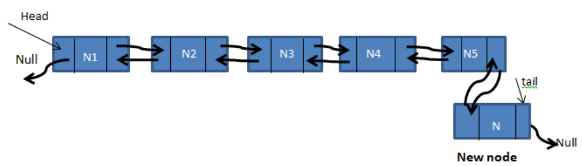
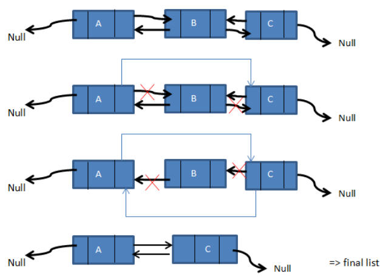

<div id="top"></div>

<h1 align="center"> AP course HW  </h1>

<p align="center">
    <a alt="Version">
        </a>
    <a  alt="Downloads">
        </a>
    <a href="https://github.com/RabihND/AP2021-2022-Final/graphs/contributors" alt="Contributers">
        </a>
    <a href="https://github.com/RabihND/AP2021-2022-Final//network/members" alt="Forks">
        </a>
    <a href=" https://github.com/RabihND/AP2021-2022-Final/stargazers">
        </a>
    <a alt="Visitors">
        </a>
    <a href="https://github.com/RabihND/AP2021-2022-Final/master/LICENSE.txt">
        </a>
    
</p>

<!-- PROJECT LOGO -->
<br />
<div align="center">

  <h3 align="center"> Doubly-LinkedList📦</h3>
  <p align="center"></p>
  <p align="center">
   Doubly Linked List Data Structure In C++
    <br />
    <a href="https://github.com/RabihND/AP2021-2022-Final"><strong>Explore the documents »</strong></a>
    <br />
    <br />
  </p>
</div>


---

<!-- TABLE OF CONTENTS -->
<details>
  <summary>Table of Contents</summary> 
  <ol>
    <li><a href="#about-the-project">About The Project</a></li>
    <li><a href="#parts">Parts</a></li>
    <li><a href="#results">Results</a></li>
    <li><a href="#license">License</a></li>
    <li><a href="#refenences">Refenences</a></li>
    <li><a href="#contact">Contact</a></li>
    <li><a href="#roadmap">Roadmap</a></li>
  </ol>
</details>


<!-- ABOUT THE PROJECT -->
## About The Project
<p align="center">  </p>  
<p align="justify">In this homework you should implement linked-list data structure with c++.</p>

<p align="justify">Each node has two pointers, one pointing to the previous node and the other pointing to the next node.
Only the first node (head) has its previous node set to null and the last node (tail) has its next pointer set to null.</p>


<p align="right">(<a href="#top">back to top</a>)</p>


### Built With

Major frameworks/libraries used in this project:

* [C++](https://www.cplusplus.com/)


<p align="right">(<a href="#top">back to top</a>)</p>


<!-- PARTS -->
## Parts
**Class**

**1. Add a node at the front:**

<p align="center">  </p>  

<p align="justify">The new node,here, is always placed before the Linked List's head. The freshly inserted node is now the Double Linked List's new head. For instance, if the supplied Linked List is 1234 and item 5 is added to the front, the Linked List becomes 51234. The function that adds to the front of the list will be called <b>push_front()</b>. Because push must update the head pointer to refer to the new node, <b>push_front()</b> must receive a pointer to the head pointer.</p>

```C++
oid LinkedList::push_front(double data)
{
if (tail == nullptr) {
//Empty Case
tail = new Node(data);
} else {
//Non Empty Case
Node* Current = tail;
while (Current->previous != nullptr) { The beigining from the tail -> head
Current = Current->previous; (where cur.prev equal zero)
}
Node* Temp = new Node(data);
Temp->next = Current;
Temp->previous = nullptr;
Current->previous = Temp;
head = Temp;
}
};
```

**2. Insertion at the end:**

<p align="center">  </p> 

<p align="justify">We are given a pointer to a node as prev_node, and the new node is inserted after the given node.</p>

>Same as **push_front()** but here we start from the head up toward tail.

```C++
void LinkedList::push_back(double data)
{
if (head == nullptr) {
// Empty Case
head = new Node(data);
// delete[] head;
} else {
// Non Empty Case
Node* Current = head;
while (Current->next != nullptr) {
Current = Current->next;
}
Node* Temp = new Node(data);
Temp->next = nullptr;
Temp->previous = Current;
Current->next = Temp;
tail = Temp;
}
};
```

**3. Deleting:**

<p align="justify">A node in a doubly-linked list can be erased from any position, such as the front, end, or any other place or data.When removing a node from a doubly-linked list, we must first relocate the pointer referring to that node such that the preceding and following nodes have no relationship to the node to be removed.
The node can then be simply deleted.
Consider the following three-node doubly linked list: A, B, and C. Consider the case when we need to remove node B.</p>

<p align="center">  </p> 

<p align="justify">We have shown the deletion of node B from the supplied linked list in the above sequence of diagrams. Even if the node is first or last, the operation sequence stays the same. The only precaution to consider is that if the first node is removed, the prior reference of the second node will be set to null.</p>
<p align="justify">Similarly, when the final node is destroyed, the prior node's next pointer is set to null. If the nodes in between are removed, the sequence will be as shown above.</p>


<p align="right">(<a href="#top">back to top</a>)</p>

<!-- RESULTS -->
## Results

**GUI OUTPUT:**
<details>
<summary>ScreenShoot Preview 🖼️</summary>
  <body>
    <p align="center">  </p>
  </body>
</details>

---

**TERMINAL OUTPUT:**
<details>
<summary>ScreenShoot Preview 🖼️</summary>
  <body>
    <p align="center">  </p>
  </body>
</details>

<p align="right">(<a href="#top">back to top</a>)</p>

<!-- LICENSE -->
## License

Distributed under the MIT License. See `LICENSE.txt` for more information.

<p align="right">(<a href="#top">back to top</a>)</p>

<!-- REFERENCES -->
## Refenences

🔎

<p align="right">(<a href="#top">back to top</a>)</p>


<!-- CONTACT -->
## Contacts


Rabih ND - [@RabihND](https://github.com/RabihND) 

Hasan Sanei - [@hasansanei](https://github.com/hasansanei)

**Project Link:** [https://github.com/RabihND/AP2021-2022-Final](https://github.com/RabihND/AP2021-2022-Final)

<p align="right">(<a href="#top">back to top</a>)</p>


<!-- ROADMAP -->
## Roadmap

- [x] Write the main code-map.
- [x] Design the GUI window. 
- [x] Write the MasterMain Core Functions.
- [x] Design the GameOver window.
- [x] <a href="https://github.com/RabihND/AP2021-2022-Final/releases/latest"><strong>Build the .EXE Release</strong></a>
- [ ] Splash screen
- [ ] Build APK release.

<p align="right">(<a href="#top">back to top</a>)</p>


---
<div align="center">
<p>

<p align="center"><b>
Amirkabir University  of Technology</b>

(Tehran Polytechnic)
</p>
</p>
</div>


